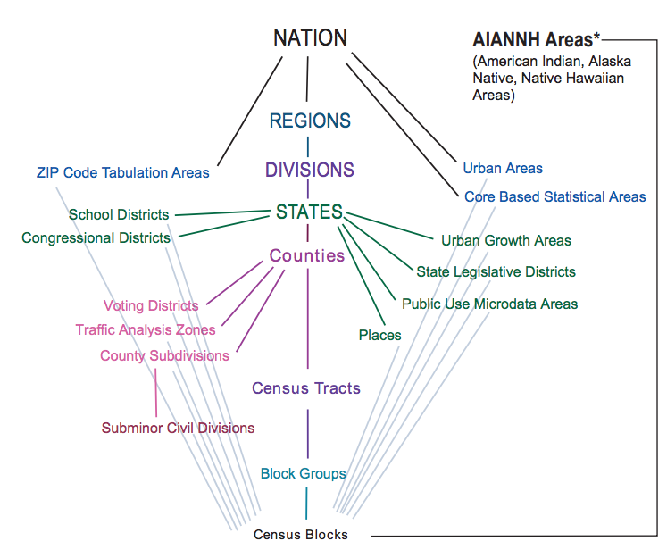

<style type="text/css">
/* style information here: https://stackoverflow.com/questions/25646333/code-chunk-font-size-in-rmarkdown-with-knitr-and-latex */

body, td {
   font-size: 12px;
}
code.r {
/* this controls font size for code echoed from the chunk */
  font-size: 10px;
}
pre {
 /* this controls font size in the chunk */
  font-size: 10px;
}
li {
  font-size: 11px;
  line-height: 1.5;
}
</style>


```{r setup, include=FALSE}
knitr::opts_chunk$set(echo = TRUE)
```

<br>

# Accessing Census Data Through R 

There are multiple packages available for accessing census data. One is ```censusapi```, which we can learn about through the introductory vignette [here](https://cran.r-project.org/web/packages/censusapi/vignettes/getting-started.html) or through the documentation [here](https://cran.r-project.org/web/packages/censusapi/censusapi.pdf). To set the key as an environmental variable, use ``` Sys.setenv(CENSUS_KEY="YOUR_KEY_HERE")```.  If we want to obtain data for the entire U.S., it may be necessary to use the iterative capabilities of the [```purrr``` package](https://cran.r-project.org/web/packages/purrr/purrr.pdf).  To decide which data set we wish to use for our analysis, the full list of those available through the census API is [here](https://api.census.gov/data.html). 

For example, the following code iterates over every state FIPS code in the U.S., extracts the variables ```pct_Pop_NoCompDevic_ACS_15_19```, ```pct_Pop_w_BroadComp_ACS_15_19```, ```pct_Civ_unemp_16p_ACS_15_19``` at the tract level, and returns a data frame with each row representing a specific tract.


```{r, eval = FALSE}

get_census_data_tract <- function(state_code) {
  region_for_state = paste0("state:", state_code, "+county:*")
  result <- tryCatch( 
    {
    getCensus(name = "pdb/tract",
                      vintage = 2021,
                      key = Sys.getenv("CENSUS_KEY"),
                      vars = c( 
                               "pct_Pop_NoCompDevic_ACS_15_19",
                               "pct_Pop_w_BroadComp_ACS_15_19",
                               "pct_Civ_unemp_16p_ACS_15_19"
                               ),
                      regionin = region_for_state,
                      region = "tract:*")
          } ,
      error=function(e) {
            return()
        } 
      )
  return(result)
}


# get tract level data for all states
# state_codes is a vector containing all FIPS codes for states in the U.S.
tract_level_data <- map_dfr(state_codes,  ~get_census_data_tract(.x))

```

## Units of Analysis


Depending on the analysis we want to perform, we may select a different unit defined by the Census. To understand the geographic hierarchy of census units, we can reference the following definitions. 


The diagram below, accessible at the Census page [here](https://www2.census.gov/geo/pdfs/reference/geodiagram.pdf), demonstrates the relationships between all the units.



Looking at this diagram, we can see why the line in the previous function ```region_for_state = paste0("state:", state_code, "+county:*")``` works as intended, selecting all tracts within all counties (using the character *) within the given state (passed as ```state_code```). 


#### Definitions for Each Unit: 

These definitions are from the glossary here [here](https://www.census.gov/programs-surveys/geography/about/glossary.html#:~:text=Block%20Groups%20(BGs)%20are%20statistical,data%20and%20control%20block%20numbering). 

<table>
  <tr><td>Geographic Unit</td><td>Definition</td>
  <tr><td>Public Use Microdata Areas (PUMAs)</td><td>-  "non-overlapping, statistical geographic areas that partition each state or equivalent entity into geographic areas containing no fewer than 100,000 people each"<br>
  -  "cover the entirety of the United States, Puerto Rico, Guam, and the U.S. Virgin Islands. The Census Bureau defines PUMAs for the tabulation and dissemination of decennial census and American Community Survey"</td>
  <tr><td>al;kdfj</td><td>;aldskfj</td>
  <tr><td>al;kdfj</td><td>;aldskfj</td>
  <tr><td>al;kdfj</td><td>;aldskfj</td>

</table>


ZIP Code Tabulation Areas (ZCTAs)  "approximate area representations of U.S. Postal Service (USPS) five-digit ZIP Code service areas that the Census Bureau creates using whole blocks to present statistical data from censuses and surveys. The Census Bureau defines ZCTAs by allocating each block that contains addresses to a single ZCTA, usually to the ZCTA that reflects the most frequently occurring ZIP Code for the addresses within that tabulation block. Blocks that do not contain addresses but are completely surrounded by a single ZCTA (enclaves) are assigned to the surrounding ZCTA; those surrounded by multiple ZCTAs will be added to a single ZCTA based on limited buffering performed between multiple ZCTAs. The Census Bureau identifies five-digit ZCTAs using a five-character numeric code that represents the most frequently occurring USPS ZIP Code within that ZCTA, and this code may contain leading zeros."
